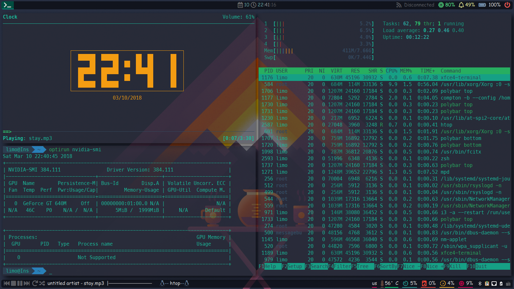
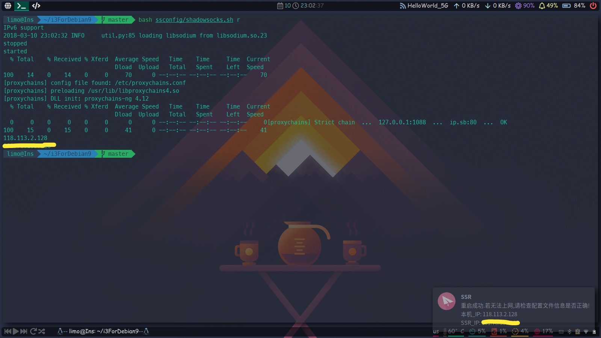
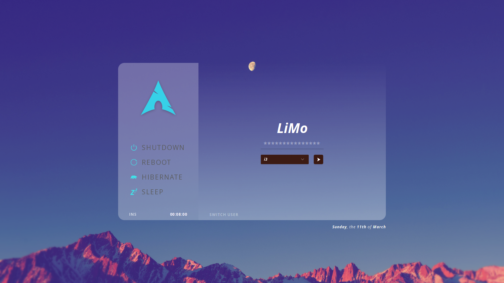

# i3 For Debian9 Testing 备份

#### 新手 , 代码很烂 . 不过能跑(权当个人备份) ....
#### i3ForUbuntu16.04 将会删除, 不再更新 .

------
## 安装方式

#### 最小化安装 Debian9 Testing , [官方NetBootNonFreeWeeklyISO镜像](https://cdimage.debian.org/cdimage/unofficial/non-free/cd-including-firmware/weekly-builds/amd64/iso-cd/)
#### 安装完成后使用普通用户登录 tty
#### 克隆该仓库到 HOME 目录
```sh
cd ~
su root
apt update
apt install git
git clone https://github.com/LimoYuan/i3ForDebian9.git
cd i3ForDebian9/Install
su root
bash ./000_install_sudo_bash-templetion.sh
su youCreateUsername
bash ./001_install_driver_and_app.sh
```
#### 或者点击 [Download ZIP](https://github.com/LimoYuan/i3ForDebian9/archive/master.zip) , 下载到你的移动设备在tty下挂载后解压到 ~ 或者下载到手机中在同一局域网利用 ftp 软件然后 wget 到 ~ 目录
```sh
cd ~
su root
apt install unzip
su youCreateUsername
unzip i3ForDebian9-master.zip && mv i3ForDebian9-master i3ForDebian9
cd i3ForDebian9/Install
su root
bash ./000_install_sudo_bash-templetion.sh
su youCreateUsername
bash ./001_install_driver_and_app.sh
```
## 安装支持
```sh
# 执行 000 脚本后
bash ./000_install_sudo_bash-templetion.sh
# 输入你创建的用户名之后 , 会看到这个提示 Please select install option [vir == VirtualBox ; in == Intel + Nvidia ; pc == Nvidia ; other == exit 对应功能见下面表格
# 需要注意的是 pc 选项没有经过测试 .....
# 同样需要注意的时 , 如果VirtualBox 安装成功重启后 , 如果登录界面黑屏直接输入密码回车即可进入桌面 , 猜测是因为没有使用独立显卡启动虚拟机的原因 . 其中 Compton 无法透明也可能是相同原因, 只在虚拟机上出现
```
| 选项 | 对应设备 |
| :---: | :---: |
| vir | VirtualBox 虚拟机 |
| in | Intel + Nvidia 双显卡笔记本 |
| pc | 单 Nvidia 显卡电脑 or 笔记本 |
| other | 退出安装脚本 |
### 详细安装方式:
```sh
# 克隆或解压到普通用户$HOME目录后
cd ~/i3ForDebian9/Install
# 如果是 VirtualBox 虚拟机 , 请务必点击虚拟机的安装增强功能后方可继续 . 如果不是请忽略 .
# 切换到 root 用户
su root
# 执行 000_install_sudo_bash-templetion.sh
./000_install_sudo_bash-templetion.sh
# 看到 tty 提示 Please select install option 时 ,根据提示输入 vir ( VirtualBox ) in (I + N 双显卡笔记本); pc ( Nvidia 单显卡台式或者笔记本 ) 具体请看上方表格
# 安装过程中需要输入你创建的普通用户账号 , 具体看到提示后操作
# 000 脚本安装完成后 , 切换到你创建的普通用户
su youCreateUsername #你创建的普通用户
# 执行 001 脚本
./001_install_driver_and_app.sh
# 安装过程中需要你输入一些信息 , 请按提示输入
# 001 脚本中会安装 OhMyZsh , OhMyZsh 安装后会自动进入 zsh , 请输入 exit 退出后继续
# 脚本安装完成会自动重启
```
## 截图






------

## 脚本中安装的所有软件包 ( 可能会有增加, 具体请参考脚本 )
#### 000_install_sudo_*.sh 中安装的软件 :
```sh
debiancn-keyring.deb # Debiancn 源
apt -y install sudo bash-completion
# 虚拟机安装 . 在执行该脚本之前 , 需要安装 vbox 扩展 , 并点击 vbox 菜单栏中的安装增强功能的选项
apt -y install linux-headers-$(uname -r|sed 's/[^-]*-[^-]*-//') \
    linux-headers-$(uname -r|sed 's,[^-]*-[^-]*-,,') \
    linux-image-$(uname -r|sed 's,[^-]*-[^-]*-,,')
apt -y install xserver-xorg-input-evdev \
    xserver-xorg-input-kbd \
    xserver-xorg-input-mouse \
    xserver-xorg-input-synaptics \
    xserver-xorg-video-vesa \
    xserver-xorg-video-vmware \
    x11-xserver-utils \
    x11-utils \
    x11-xkb-utils #virtualbox-guest-x11 virtualbox-guest-utils
apt -y install build-essential make perl
mount /dev/sr0 /mnt/ && cd /mnt
./VBoxLinuxAdditions.run
# I + N 笔记本安装
apt -y install linux-image-$(uname -r|sed 's,[^-]*-[^-]*-,,') \
    linux-headers-$(uname -r|sed 's,[^-]*-[^-]*-,,') broadcom-sta-dkms
modprobe -r b44 b43 b43legacy ssb brcmsmac bcma
modprobe wl
apt -y install linux-headers-$(uname -r|sed 's/[^-]*-[^-]*-//') \
    linux-headers-$(uname -r|sed 's/[^-]*-[^-]*-//') nvidia-driver
apt -y install bumblebee-nvidia primus
apt -y install xserver-xorg-input-evdev \
    xserver-xorg-input-kbd \
    xserver-xorg-input-mouse \
    xserver-xorg-input-synaptics \
    x11-xserver-utils \
    x11-utils x11-xkb-utils \
    firmware-brcm80211 nvidia-smi
```
#### 001_install_driver_and_app*.sh 中安装的软件 :
```sh
sudo apt -y install lightdm i3 git vim neofetch feh resolvconf \
    fonts-wqy-zenhei lxappearance gdebi qt4-qtconfig compton \
    curl wget ranger volumeicon-alsa alsa-utils pulseaudio \
    pavucontrol fonts-arphic-uming arandr xdg-utils \
    wpasupplicant htop p7zip-full xfce4-terminal \
    xfce4-notifyd zsh xfce4-power-manager* thunar \
    breeze-cursor-theme file-roller pulseaudio-module-bluetooth \
    blueman rofi xbindkeys zsh-syntax-highlighting scrot \
    imagemagick zathura* tk parcellite network-manager network-manager-gnome \
    mesa* gpick

sudo apt -y install fcitx fcitx-data fcitx-frontend-qt4 \
    fcitx-libs-qt fcitx-module-x11 fcitx-bin fcitx-frontend-all \
    fcitx-frontend-qt5 fcitx-table fcitx-config-common \
    fcitx-frontend-fbterm fcitx-libs fcitx-module-dbus \
    fcitx-table-wubi fcitx-config-gtk fcitx-frontend-gtk2 \
    fcitx-libs-dev fcitx-module-kimpanel fcitx-ui-classic \
    fcitx-config-gtk2 fcitx-frontend-gtk3 fcitx-modules

sudo apt -y install telegram-desktop google-chrome-stable \
    sogoupinyin atom code numix-gtk-theme numix-icon-theme

sudo apt -y install lightdm-webkit2-greeter

sudo gdebi -n $workPath/osx-arc/osx-arc*.deb

# gksudo Debian testing 已移除
sudo gdebi -n $workPath/gksudoPkg/libgtop2-7*.deb
sudo gdebi -n $workPath/gksudoPkg/libgksu2-0_2*.deb
sudo gdebi -n $workPath/gksudoPkg/gksu_2*.deb

# 以及 MPD NCMPCPP

# 编译安装的软件及编译所需的依赖就不列出了 , 可以自行翻看脚本
```
## i3wm 快捷键
| KeyMap | Action |
| :---: | :---: |
| Mod | Mod4(win) |
| Mod+Return | xfce-terminal |
| Mod+Tab | rofi window |
| Mod+d | rofi drun |
| Mod+F10 | SSR Start |
| Mod+F11 | SSR Stop |
| Mod+F12 | SSR Restart |
| Mod+ascfuiop90 | 1 - 10 工作区 |
| Mod+hjkl | 切换窗口快捷键(左下上右) |
| Mod+r (hjkl or up down left right) | 修改浮动窗口大小 |
| Mod+space | 切换到浮动窗口之后的窗口 |
| Mod+Shift+space | 切换窗口为浮动 / 退出浮动 |
| Mod+Shift+ascfuiop90| 移动当前窗口到其它工作区 |
| Mod+Shift+hjkl | 移动当前窗口在当前工作区中的位置 |
| Mod+Shift+d | rofi run |
| Mod+Shift+q | 自定义 rofi 电源按钮 |
| Mod+Shift+t | 重新加载 i3 配置文件 |
| Mod+Shift+r | 重启 i3wm |
| Mod+Control+k | 结束当前应用窗口|
| Mod+Control+h | 水平方向打开下一个窗口 |
| Mod+Control+v | 垂直方向打开下一个窗口 |
| Mod+Control+f | 切换当前窗口全屏 / 退出全屏 |
| Mod+Control+s | 切换窗口为折叠上下布局 |
| Mod+Control+z | 切换窗口为折叠左右布局 |
| Mod+Control+e | 切换窗口为split方式布局,也可用来退出前两种布局 |
| Mod+Control+l | dm-tool lock |
| Mod+Control+c | 自定义锁屏 |
| Mod+Control+t | Thunar |
| workspace_auto_back_and_forth | Mod+a,Mod+s;Mod+a/s 来回切换as工作区 |
### 关于 Shadowsocksr_Python 版 , 以及 Chrome SwitchOmega 使用说明

- 安装成功后 , 用户家目录下 ssconfig 中包含了一个 ssr 的 config.json 的配置示例文件 , 可以添加你自己的节点信息保存后使用 MOD+F12 重启 SSR
- 对于国内用户,没有 vpn 或者 路由器翻跃长城的情况下, i3ForDebian9 包含了 SwitchOmega , 请在 chrome 中打开 chrome://extensions , 打开开发者模式 . 将 SwitchyOmega_Chromium.crx 拖拽到 chrome 中修改配置即可 .

-------
## 该脚本使用到的一些程序和文件来自 :
#### [i3Gaps](https://github.com/Airblader/i3)
#### [Polybar](https://github.com/jaagr/polybar)
#### [lightdm-webkit2-greeter](https://github.com/Antergos/web-greeter)
#### [lightdm-webkit2-greeter_Themes](https://github.com/NoiSek/Aether)
#### [Fonts_awesome](https://fontawesome.com/)
#### [Fonts_material-design-icons](https://github.com/google/material-design-icons)
#### [Fonts_Setting](https://ohmyarch.github.io/2017/01/15/Linux%E4%B8%8B%E7%BB%88%E6%9E%81%E5%AD%97%E4%BD%93%E9%85%8D%E7%BD%AE%E6%96%B9%E6%A1%88/)
#### [Grub_Themes](https://github.com/vinceliuice/grub2-themes)
#### [Shadowsocksr_python](https://github.com/shadowsocksr-backup/shadowsocksr)
#### [Proxychains-ng](https://github.com/rofl0r/proxychains-ng)
#### [Oh-My-Zsh](https://github.com/robbyrussell/oh-my-zsh)
#### [VimPlus](https://github.com/chxuan/vimplus)
#### 诚谢以上项目 . 可能还有其他没有列出 . 之后再添加
